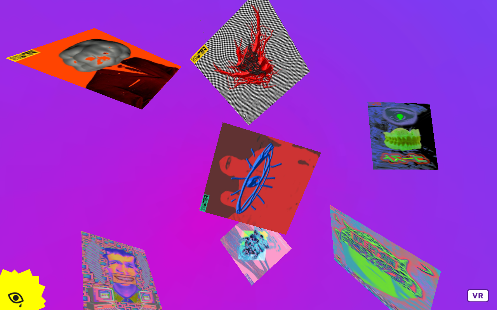

# Misha Skvortsov

Where I took the first steps in mastering the virtual space. It's a web site for designer from Odessa, who create awesome glitch pixel art.



## STRUCTURE
```
├── assets
│   ├── css
|   |   └── style.css
│   ├── img
|   |   ├── branding
|   |   |   ├── brand.png
|   |   |   └── logo-192x192.png
|   |   ├── covers
|   |   |   ├── cover-1200x675.jpg
|   |   |   └── cover-1280x800.jpg
|   |   └── icons
|   |       ├── icon-16x16.png
|   |       ├── icon-32x32.png
|   |       ├── icon-60x60.png
|   |       ├── icon-76x76.png
|   |       ├── icon-96x96.png
|   |       ├── icon-120x120.png
|   |       ├── icon-144x144.png
|   |       ├── icon-152x152.png
|   |       ├── icon-180x180.png
|   |       └── icon-192x192.png
│   ├── js
|   |   └── app.js
│   └── libs
|       ├── aframe-1.0.4.min.js
|       └── jquery-3.5.1.min.js
├── favicon.png
├── index.html
├── LICENSE
├── README.md
└── screenshot.jpg
```

## BUILT WITH
- [A-Frame 1.0.4](https://github.com/aframevr/aframe/releases/tag/v1.0.4)
- [jQuery 3.5.1](https://github.com/jquery/jquery/releases/tag/3.5.1)

## CONTRIBUTOR
Oleksandr Klochko [@utoyvo](https://github.com/utoyvo).

## LICENSE
Code released under the [MIT](LICENSE).
